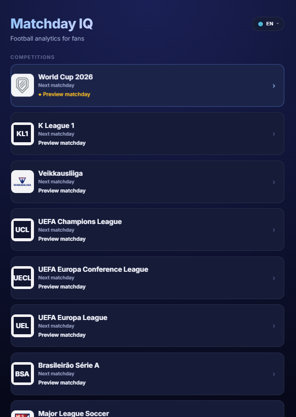
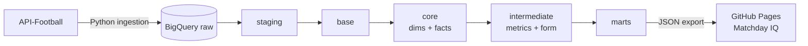

# Football Data Platform

An ELT pipeline for football data: daily ingestion from API-Football into BigQuery, transformed with dbt across a medallion architecture (staging → base → core → intermediate → marts), and served to a web app. Multi-competition and multilingual.

[](https://github.com/ramialfahham/football-data-pipeline/actions/workflows/ci-validate.yml)
[](https://github.com/ramialfahham/football-data-pipeline/actions/workflows/ci-data-build.yml)
[](LICENSE)
[](https://www.getdbt.com/)
[](https://cloud.google.com/bigquery)
[](https://www.python.org/)

### Live preview — [Matchday IQ](https://ramialfahham.github.io/football-data-pipeline/match-preview/)

A first cut of the fan-facing app. The full v2 web app — new information architecture, richer player and match insights — is in active development.

**[Explore the data model →](https://ramialfahham.github.io/football-data-pipeline/dbt-docs/)** — dbt lineage graph, model and column docs, generated from the project.



## Architecture



## Highlights

- **Zero-file league onboarding** — a new competition is a single registry entry; a CI-enforced contract prevents any SQL or Python change.
- **Automated data-quality tests** gate every build.
- **Cost-controlled** — one scheduled run per day; ingest budget is explicit per competition.
- **Multilingual** (DE / EN / FI), multi-competition by design.
- **CI/CD on GitHub Actions** — lint, validation, data build, security scanning, and scheduled deployment.
- **v2 web app** with new information architecture and richer insights in active development.

## Design decisions

This is a personal project, and its central constraint is scaling across many competitions without the maintenance cost growing with each one. A few decisions follow from that:

- **One set of raw tables, discriminated by `league_code`.** Rather than per-competition tables (which multiply the model count with every league), all competitions share unified raw tables keyed by a `league_code` column that flows through every layer. Adding a competition is a single [registry entry](docs/competition_registry.yml) — no new SQL or Python — and a [CI check](scripts/check_layer_contract.py) fails the build if anyone reintroduces per-competition models.

- **A strict layer contract.** Each medallion layer has one job (staging = cleanup, core = system of record, marts = consumption), enforced so the boundaries don't erode: a bug has an obvious layer to live in, a new requirement an obvious home. See [layering.md](dbt_project/docs/layering.md).

- **Data quality is a build gate, not a review step.** The numbers are shown directly to fans, who can't verify them — so correctness is enforced by automated tests on every build (keys, referential integrity, grain). A model that breaks its contract fails the pipeline rather than shipping a wrong number. See [engineering_standards.md](dbt_project/docs/engineering_standards.md).

- **Metrics are defined once.** Every metric lives in a machine-readable catalogue and is consumed from there, never re-derived inside a mart — so the same metric stays consistent everywhere, and the definitions stay tool-readable (a foundation for a future semantic layer).

- **Identity is modelled separately from affiliation.** Players and teams change clubs and seasons, so the stable entity is kept distinct from its affiliations over time, and facts reference the entity. It costs a join and buys correct answers to historical questions.

## BigQuery layout (datasets)

BigQuery uses **datasets** as the unit that other databases often call **schemas**. This repo uses **one dataset per medallion layer** in the same GCP project:

| Dataset | Role |
|---------|------|
| **`raw`** | 1:1 loads from Python (`RAW_*` tables). Default; override with `API_FOOTBALL_BIGQUERY_DATASET` (ingestion) and dbt **`raw_schema`** var (must match). |
| **`staging`** | dbt `1_staging` — light cleanup on top of `raw`. |
| **`base`** → **`marts`** | dbt `2_base` … `5_marts` per `dbt_project.yml`. |

dbt uses [`macros/generate_schema_name.sql`](dbt_project/macros/generate_schema_name.sql) so layer names map **directly** to dataset ids (not `dbt_scratch_staging`). The profile’s default **`dataset`** (`dbt_scratch` in `profiles.example.yml`) is only a fallback for nodes without `+schema`.

Details and multi-source conventions: [`dbt_project/docs/layering.md`](dbt_project/docs/layering.md).

**Competition scope:** active competitions are **BL1** (German Bundesliga), **WC** (FIFA World Cup 2026), and the six confederation qualifier leagues (WCQEU, WCQAF, WCQCA, WCQSA, WCQAS, WCQIP, WCQOC). The competition registry lives in `docs/competition_registry.yml`; adding a new competition requires only a YAML entry and a set of staging models — no changes to the ingestion package.

**Layer population (current state):**

| Layer | Status | What is there |
|-------|--------|---------------|
| `1_staging` | populated | 27 models — 13 `stg_apif__bl1_*` (Bundesliga) + 14 `stg_apif__wc_*` (World Cup + qualifiers). |
| `2_base` | populated | 12 models — `base_apif__bl1_*` and `base_apif__wc_*` (UNION ALL + dedup). |
| `3_core` | populated | 6 dims (`dim_date`, `dim_league`, `dim_competition_season`, `dim_team`, `dim_player`), 5 facts (`fct_fixture`, `fct_standings`, `fct_fixture_team_stats`, `fct_fixture_player_stats`, `fct_fixture_event`). |
| `4_intermediate` | 6 models | `int_pipeline__raw_ingestion_spread` (ingestion-spread audit); `int_team_season__standings_primary` (deduped standings for marts); `int_matchday__fixture_denormalized`, `int_matchday__finished_fixture_team_leg`, `int_matchday__upcoming_round_fixtures`, `int_matchday__team_form_metrics` (matchday spine + form). |
| `5_marts` | populated | Matchday/team-season insights (`mart_matchday_insights` all domestic leagues, `mart_matchday_insights_wc`, `mart_matchday_insights_bl1_relegation`, `mart_team_season_insights`), plus `mart_team_season`, rankings/scorers, debug. Slice by `league_code` at export/UI. |

## dbt (local setup)

The dbt project lives in `dbt_project/`. For CI/CD readiness, `profiles.yml` is **not** committed.

- Copy `dbt_project/profiles.example.yml` to your local dbt profiles directory as `profiles.yml`
  - Default location on Windows: `%USERPROFILE%\.dbt\profiles.yml`
  - Or set `DBT_PROFILES_DIR` to point to a folder containing `profiles.yml`

**Local Python (single convention):** the repo uses **`.venv/`** at the root (gitignored). Set it up once, then use it for ingestion, dbt, and SQLFluff:

```powershell
python -m venv .venv
.\.venv\Scripts\Activate.ps1
pip install -r requirements.txt
```

### Pre-commit hooks (local quality gate)

`.pre-commit-config.yaml` runs sqlfluff (SQL lint), ruff (Python lint + format), basic file hygiene checks, and the existing secret scan. Catches the class of bug that auto-merged-without-CI used to ship to main.

```powershell
pip install pre-commit
pre-commit install
```

After install, hooks run automatically on every `git commit`. A failing hook blocks the commit. To run all hooks on the full repo (e.g. after the first install):

```powershell
pre-commit run --all-files
```

CI runs the same sqlfluff via `ci-validate` as defense-in-depth, but catching lint locally is fast (~5s on small diffs) and avoids round-tripping through GitHub.

Run dbt from the repo root with **`.venv`** activated:

```powershell
dbt --version
dbt deps --project-dir .\dbt_project
dbt debug --project-dir .\dbt_project
dbt parse --project-dir .\dbt_project
```

## Data Quality (tests)

Recommended local workflow:

```powershell
# Staging-only checks (fast, catches raw load issues early)
dbt build --project-dir .\dbt_project --selector staging

# Snapshot history tables first (standings), then all downstream (core + intermediate)
dbt snapshot --project-dir .\dbt_project
dbt build   --project-dir .\dbt_project --selector downstream

# Full suite (staging + downstream + tests)
dbt build --project-dir .\dbt_project

# Selector "base" and "marts" are defined but currently match no models.
# dbt build --project-dir .\dbt_project --selector base
# dbt build --project-dir .\dbt_project --selector marts

# Optional: point dbt at a non-default raw dataset (must match ingestion target)
# dbt build --project-dir .\dbt_project --vars "{ raw_schema: raw_dev }"
```

For expectations by layer (grain, `not_null`, `unique`, avoiding duplicate tests downstream), see [engineering_standards.md §3 (Testing policy)](dbt_project/docs/engineering_standards.md).

## dbt Layer Contract

This project follows a strict layer contract so transformations stay predictable and testable.

- `1_staging`: raw cleanup only (renaming, typing, light normalization). No cross-source unions/joins (details in [layering.md §1_staging](dbt_project/docs/layering.md#1_staging)).
- `2_base`: preparation for **core**—entity resolution, shared identifiers, and first logical standardization across sources (unions/alignment where the same real-world entity appears in more than one staging place). Structural tests on grains and keys you define here—not the authoritative dimension/fact system of record (that is `3_core`).
- `3_core`: reusable business entities and clean relationship logic.
- `4_intermediate`: heavier transformations and feature engineering.
- `5_marts`: app/BI-ready outputs for consumption.

Further reading:

- Detailed layering rules: [dbt_project/docs/layering.md](dbt_project/docs/layering.md)
- Engineering standards: [dbt_project/docs/engineering_standards.md](dbt_project/docs/engineering_standards.md)
- API-Football data contract: [docs/data_contract.md](docs/data_contract.md)
- Development workflow: [docs/development_workflow.md](docs/development_workflow.md)

## Maintenance & operations

- **Runbook and troubleshooting** (environment variables, ingest lock, completeness checks, backfill vs daily update): [`docs/operations_guide.md`](docs/operations_guide.md).
- **Cursor / AI governance:** three focused rule files in [`.cursor/rules/`](.cursor/rules/) — [`agent-behavior.mdc`](.cursor/rules/agent-behavior.mdc) and [`project-context.mdc`](.cursor/rules/project-context.mdc) always apply; [`dbt.mdc`](.cursor/rules/dbt.mdc) and [`ingestion.mdc`](.cursor/rules/ingestion.mdc) load only when the agent is editing files in the matching directory. Rules encode evergreen intent and point at the authoritative docs rather than duplicating them.
