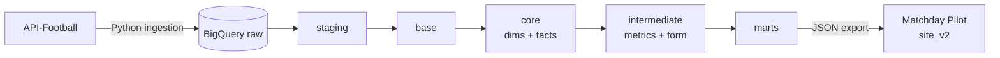

# Football Data Platform

An ELT pipeline for football data: daily ingestion from API-Football into BigQuery, transformed with dbt across a medallion architecture (staging → base → core → intermediate → marts), then exported as JSON for a fan-facing web app. Multi-competition and multilingual.

[](https://gitlab.com/rami.al-fahham/football-data-pipeline)
[](LICENSE)
[](https://www.getdbt.com/)
[](https://cloud.google.com/bigquery)
[](https://www.python.org/)

**Status.** The pipeline runs daily. The web app, Matchday Pilot (`site_v2/`), is in development.

## Getting started

### Prerequisites

| Tool | Version | Needed for |
|---|---|---|
| Python | 3.11 | everything (pinned in `.python-version`) |
| Node.js | 24 | setup and the site (pinned in `.nvmrc` and `site_v2/package.json`) |
| git | any recent | everything |
| [uv](https://docs.astral.sh/uv/) | any recent | only the dbt tool inside Claude Code (`.mcp.json`) |
| [Google Cloud CLI](https://cloud.google.com/sdk/docs/install) | any recent | only the credentialed level below |

**Windows: clone into a short folder**, for example `C:\src\football-data-pipeline`. Some installed
files sit 150 characters below the repo folder, and Windows refuses paths over 259 characters
unless long paths are turned on. Setup stops with this explanation if the folder is too deep. To turn
long paths on instead (once per machine, PowerShell as administrator):
`New-ItemProperty -Path "HKLM:\SYSTEM\CurrentControlSet\Control\FileSystem" -Name LongPathsEnabled -Value 1 -PropertyType DWORD -Force`

### Set up (no credentials needed)

```bash
git clone https://gitlab.com/rami.al-fahham/football-data-pipeline.git
cd football-data-pipeline
python scripts/bootstrap.py
```

On Windows, if `python` is not 3.11: `py -3.11 scripts/bootstrap.py`.

It creates `.venv` with every `requirements*.txt`, installs the git hooks (pre-commit), the site's
packages, the dbt packages and Playwright's Chromium, creates `.env` and `profiles.yml` from their
examples, and names the GitLab remote `gitlab`. It is safe to run again: no existing local file is
overwritten.

### Prove it works

```bash
python scripts/bootstrap.py --verify
```

Runs the tests, every pre-commit check on every file, and the site build from the committed sample
data. Preview the site with `npm run dev --prefix site_v2` (http://localhost:4321).

Every commit then runs the pre-commit checks (ruff with CI's rules in `.ruff-ci.toml`, file hygiene,
the secret scan), pushes the branch to `gitlab` and opens a merge request if it has none (`.githooks/post-commit`).
CI's `lint:python` job runs the same checks on every file. SQL lint runs in CI's data jobs, not in
pre-commit; without credentials, lint a model from the repo root with
`python -m sqlfluff lint <model file> --templater jinja` (models that call `dbt_utils` report false
errors).

### With credentials (dbt against BigQuery, ingestion)

- **BigQuery:** run `gcloud auth application-default login` with a Google account that has access to
  project `football-data-pipeline-gcp`. dbt uses `profiles.yml` in the repo root (created by setup,
  `dev` target only, gitignored). Check it from the repo root with `.venv` active:
  `dbt debug --project-dir dbt_project`.
- **API-Football key:** `API_FOOTBALL_API_KEY` in `.env` in the repo root (created by setup,
  gitignored). With access to the project's Secret Manager, `python scripts/bootstrap.py --fetch-key`
  writes it there without printing it (after `gcloud auth login`); it never overwrites a key that is
  already set. Read [`docs/operations_guide.md`](docs/operations_guide.md) before running an ingest:
  it spends API quota.

## Architecture


```mermaid
flowchart LR
    A[API-Football] -->|Python ingestion| B[(BigQuery raw)]
    B --> C[staging] --> D[base] --> E[core<br/>dims + facts]
    E --> F[intermediate<br/>metrics + form] --> G[marts]
    G -->|JSON export| H[Matchday Pilot<br/>site_v2]
```

## Highlights

- **Cost-controlled** — one nightly build at 04:00 UTC and an hourly data-age check; each competition's
  ingest switch and history depth are set explicitly in the [registry](docs/competition_registry.yml).
- **Multilingual** (DE / EN / FI), multi-competition by design.
- **CI/CD on GitLab** (`.gitlab-ci.yml`) — lint, tests, governance checks and a secret scan on every
  merge request, and a dbt build against BigQuery when it changes the dbt project, ingestion or the
  registry; the nightly build runs from Cloud Scheduler. The repository is developed on
  [GitLab](https://gitlab.com/rami.al-fahham/football-data-pipeline); GitHub carries a read-only
  mirror of `main`.

## Design decisions

This is a personal project, and its central constraint is scaling across many competitions without the maintenance cost growing with each one. A few decisions follow from that:

- **One set of raw tables, discriminated by `league_code`.** Rather than per-competition tables (which multiply the model count with every league), all competitions share unified raw tables carrying a `league_code` column that flows through every layer. Adding a competition is a [registry entry](docs/competition_registry.yml) plus the two files `scripts/sync_dbt_vars.py` generates from it — no new SQL or Python — and a [CI check](scripts/check_layer_contract.py) fails on a per-competition staging directory.

- **A strict layer contract.** Each medallion layer has one job (staging = cleanup, core = system of record, marts = consumption), enforced so the boundaries don't erode: a bug has an obvious layer to live in, a new requirement an obvious home. See [layering.md](dbt_project/docs/layering.md).

- **Data quality is a build gate, not a review step.** The numbers are shown directly to fans, who can't verify them — so correctness is enforced by automated tests on every build (keys, referential integrity, grain). A failing error-level test stops every model built on it, so a wrong number does not reach a mart. See [engineering_standards.md](dbt_project/docs/engineering_standards.md).

- **Metrics are defined once.** Each metric's meaning and formula is one row of the [metric catalogue](dbt_project/seeds/metric_catalogue.csv); the SQL for most of them is generated from those rows, and a test fails when the two differ. See [metric_layer.md](docs/metric_layer.md).

- **Identity is modelled separately from affiliation.** Players and teams change clubs and seasons, so the stable entity is kept distinct from its affiliations over time, and facts reference the entity. It costs a join and buys correct answers to historical questions.

## Development guardrails (AI-assisted)

This project is built largely with an AI coding agent, under guardrails that treat its changes like an
untrusted contributor's: [docs/agent_guardrails.md](docs/agent_guardrails.md) and
[docs/working_agreement.md](docs/working_agreement.md).

## Secrets

The repository is public. Never commit `.env`, API keys or tokens, service-account JSON files or
`dbt_project/.user.yml`. The pre-commit secret scan blocks the obvious ones before a commit, and CI's
`validate:secrets` job runs gitleaks on every pipeline. If a secret was ever committed: revoke it at
the provider first, then replace the value with a placeholder and commit.

## Maintenance & operations

- **Runbook and troubleshooting** (environment variables, ingest lock, completeness checks, backfill vs daily update): [`docs/operations_guide.md`](docs/operations_guide.md).
- **API-Football data contract:** [`docs/data_contract.md`](docs/data_contract.md).
- **Cursor rules:** [`.cursor/rules/`](.cursor/rules/).
